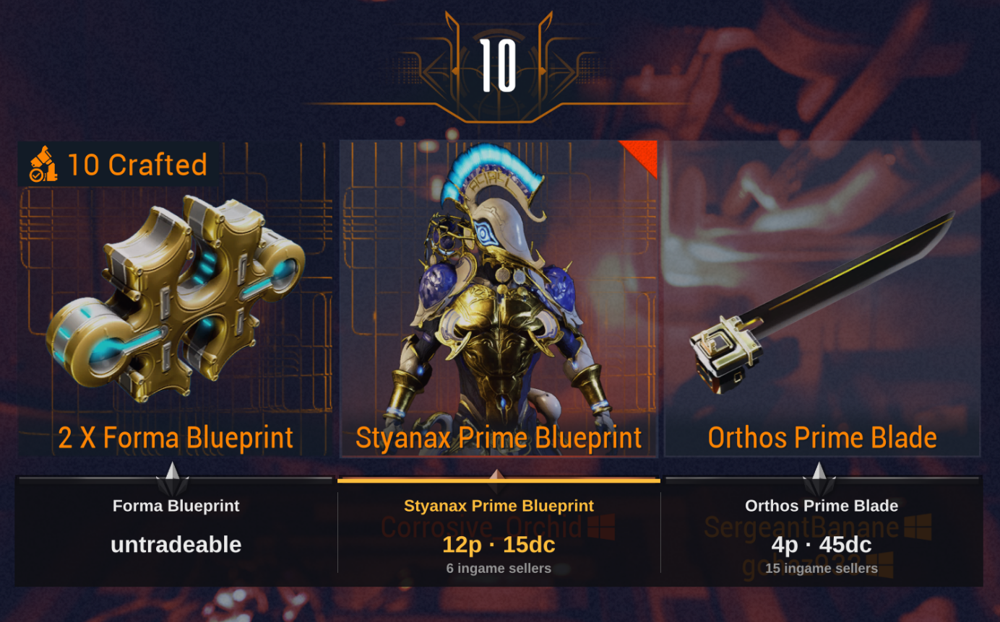

# relic-check

Warframe relic-reward price checker for Linux (X11 and Wayland). When you
crack a relic, it reads the four reward names off the screen, looks up
warframe.market prices, and prints the best pick — fast enough to act on
before the reward timer runs out.



*The overlay drawn over the live reward screen: each reward with its
platinum and ducat value, best pick highlighted.*

> [!WARNING]
> **Work in progress.** This is rough around the edges and may not work on
> your setup without tuning. It was built and tested against one machine
> (KDE Wayland, 3840×2160, 16:9, Stalker UI theme), so expect to recalibrate
> the capture regions for other resolutions and aspect ratios — see
> [Calibrating the capture band](#calibrating-the-capture-band). Known
> limitations: Requiem/Kuva relic rewards are rendered as glyph artwork with
> no text, so they can't be read at all; the screen scanner is tuned to the
> English UI; and OCR can still misread a name, so treat the output with a grain
> of salt. Expect bugs.

Everything is pure/vendored Rust: OCR is [`ocrs`](https://github.com/robertknight/ocrs)
(no Tesseract), HTTP is `ureq` with rustls, capture is `xcap`. The OCR models
are embedded in the binary, so the release build is a single self-contained
file — the only runtime dependencies are stock desktop libraries every
graphical Linux install already has (libxcb, libwayland-client, pipewire).

## Build

```sh
./fetch-models.sh        # once: downloads the two ocrs models (~12 MB)
cargo build --release
```

The models are baked into the binary with `include_bytes!`; `build.rs` will
tell you if you forgot to fetch them.

**Always use the release build.** ocrs/rten are 10–50× slower unoptimized;
the dev profile is only tolerable because `Cargo.toml` sets `opt-level = 2`
for dependencies.

## Run

```sh
./target/release/relic-check                 # uses ./config.toml
./target/release/relic-check /path/to/EE.log # override the log path
./target/release/relic-check --once          # single check right now, then exit
./target/release/relic-check --save-shots ~/relic-shots  # archive screenshots
```

`--save-shots <dir>` writes every check's full screenshot to
`<dir>/shot-<YYYYMMDD-HHMMSS>-<trigger>.png` (after the prices print, so it
costs no reaction time). Replay one later without the game running:

```sh
RELIC_CHECK_FAKE_SHOT=shot-20260712-133448-EE.log.png relic-check --once
```

Config is read from `--config <path>`, else `./config.toml`, else
`~/.config/relic-check/config.toml`, else built-in defaults.

A check is triggered by any of:

- **Screen scan** (`[scan]` in the config, off by default) — OCRs the
  "VOID FISSURE/REWARDS" title strip about once a second and fires the moment
  the reward screen appears. This is the fastest automatic trigger: the game
  flushes EE.log seconds late, but the title is on screen instantly. It
  captures only the game window (cheap, ~30 ms + a small OCR), idles when the
  game isn't running, fires once per reward screen, and stays silent on false
  positives (nothing prints unless real reward names are recognized). If a
  reward screen was already handled, the late EE.log line for it is ignored.
- **EE.log** — the game logs a line containing `Got rewards` when the reward
  screen appears. Note the game buffers log writes, so this can lag by
  several seconds; the screen scan or hotkey beats it.
- **F12** — global hotkey, works under both X11 and Wayland because it reads
  `/dev/input` directly. Requires your user to be in the `input` group
  (`sudo usermod -aG input $USER`, then re-login). Without it you'll see a
  warning and the other triggers still work.
- **Enter** in the terminal. `q`+Enter quits.

Sample output:

```
──────────────── relic rewards ────────────────
  Akstiletto Prime Blueprint      12p  100dc  (14 ingame sellers)
  Braton Prime Barrel              4p   15dc  (13 ingame sellers)
  Forma Blueprint                  0p   untradeable
► Soma Prime Stock                20p  100dc  (23 ingame sellers)
best plat:   Soma Prime Stock (20p)
trigger EE.log | capture(window) 88ms | ocr 400ms | market 180ms | total 590ms
```

The platinum price is the lowest visible sell order, preferring sellers who
are **ingame** right now (those are the trades you can actually make), then
online, then anyone.

Two ways to see results **on top of the game**:

- `[overlay] enabled = true` — a WFInfo-style panel drawn over the game via
  Wayland layer-shell (the layer above fullscreen windows): one column per
  reward aligned under the centered cards, best pick in gold, click-through,
  auto-hides after `timeout_ms`. Wayland only (KDE/wlroots); it appears on
  the same monitor the capture uses.
- `[notify] enabled = true` — a desktop notification instead: critical
  urgency renders above fullscreen on KDE. Best pick bolded; each new reward
  screen replaces the previous popup.

## Calibrating the capture band

`[band]` in `config.toml` is a single region spanning **all** the reward-name
text, as **fractions** of the captured image (`x`/`y`/`w`/`h` in 0.0–1.0), so
it survives resolution changes at the same aspect ratio. Individual names are
split out automatically from the positions of the detected words (card-sized
gaps separate neighbors; stacked lines are one wrapped name), so **any squad
size (1–4 rewards) works** even though the centered cards shift with count —
there is nothing per-slot to tune.

The default band assumes a 16:9 game at 100% HUD scale. If nothing is
recognized on a real reward screen:

1. Get to a reward screen (or take a screenshot of one).
2. Run `relic-check --once --dump-crops`. With a saved screenshot you don't
   even need the game: `RELIC_CHECK_FAKE_SHOT=shot.png relic-check --once --dump-crops`.
3. Look at `/tmp/relic-check/band.png` — it must contain every reward name
   (two-line wraps included). `screenshot.png` is the full capture for
   measuring: pixel position ÷ screen size = the fraction to put in the config.
4. Adjust `[band]` and repeat.

`cargo run --release --example fake_reward -- 2` generates a synthetic
reward screen at `/tmp/fake_reward.png` with the given number of rewards
(1–4), useful for sanity-checking the pipeline end to end.

OCR output is never trusted raw: it is snapped to the nearest real prime-part
name by Levenshtein distance over the warframe.market item list. Reads worse
than `match_threshold` (default 0.45) are shown as `unrecognized` instead of
guessed. Slightly noisy reads are fine — that's the point of the snapping —
but if a slot is consistently unrecognized, recalibrate.

## Caching

Kept under `~/.cache/relic-check/` to stay off the API during play:

- `items.json` — the item list, refreshed after 24 h (a stale copy is still
  used if warframe.market is unreachable).
- `ducats.json` — ducat values, cached forever (they never change).
- `vaulted.json` — vault status per parent prime, refreshed after 24 h.
  Sourced from warframestat.us (WFCD warframe-items data), since
  warframe.market's v2 API doesn't expose it. Vaulted rewards are tagged
  VAULTED in the terminal and on the overlay.
- Prices are cached in memory for 10 minutes per item.

## Diagnostics

Replay any saved screenshot through the whole pipeline without the game:

```sh
RELIC_CHECK_FAKE_SHOT=shot.png relic-check --once
RELIC_CHECK_FAKE_SHOT=shot.png relic-check --once --scan-test  # would the scanner fire?
```

`--scan-test` prints the raw title read and whether the screen scanner would
trigger on it — the quickest way to tell "the scanner never fired" from "the
scanner fired and the OCR was wrong".

Two environment variables expose the stages between capture and prices:

- `RELIC_CHECK_DEBUG=1` — the raw OCR text of each reward column, before
  fuzzy matching. Shows what the OCR actually saw.
- `RELIC_CHECK_DEBUG_BOXES=1` — the detected word boxes per column with their
  geometry, for debugging column/row splitting.

## Troubleshooting

- **Screenshot fails on Wayland** — monitor capture goes through
  `xdg-desktop-portal`; make sure the portal for your compositor is installed
  and running. Window capture is X11-only on most compositors; the tool falls
  back to capturing the monitor set by `monitor` in the config.
- **Monitor capture is slow on Wayland (~seconds)** — the portal screenshots
  the whole desktop to a PNG per shot; that's inherent. Use `capture = "auto"`
  instead: the game is an XWayland client, so window capture takes ~30 ms and
  is fresh whenever the game has focus — which is the case for F12 and EE.log
  triggers. Only avoid triggering from a focused terminal (Enter), as capture
  of an *unfocused* game window can return a stale frame.
- **`nothing recognized`** on a real reward screen — crop regions are off;
  see calibration above.
- **F12 does nothing** — check the startup line; if it says the hotkey is
  unavailable, add yourself to the `input` group. Enter in the terminal
  always works.
- **Wrong EE.log path** — pass it as the CLI argument or set `log_path` in
  the config. The default is the Steam/Proton location under
  `~/.local/share/Steam/steamapps/compatdata/230410/`.
